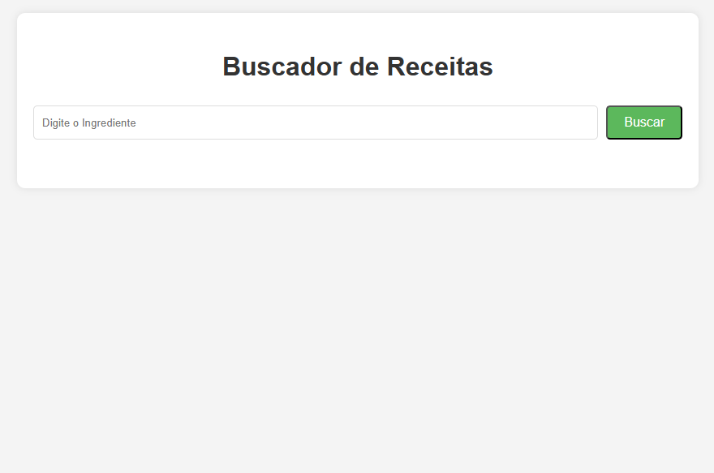
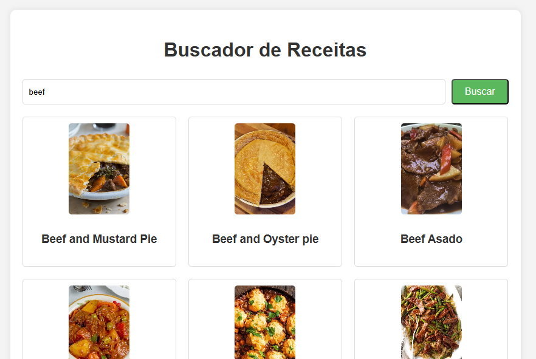

<h1>App Recipe Finder</h1> 

 
 
 

 <h3>Clique para Visualizar o Projeto: https://sthevenalves.github.io/app-recipe-finder/</h3>

  <ul>
    <li><a href="#desc">Descrição</a> 
    <li><a href="#proj">Projeto</a>
    <li><a href="#tec">Tecnologias</a>
    <li><a href="#func">Funcionalidades</a> 
 </ul> 

 <h2 id="desc">Descrição</h2>

Projeto com Busca de todas as receitas encontradas a partir de um ingrediente pesquisado.  

Os ingredientes devem ser buscados em inglês. Se você deseja Bife, digite "Beef"

<h2 id="proj">Projeto</h2>

  
  

<h2 id="tec">Tecnologias</h2>
<ul>
    <li>HTML e CSS</li>
    <li>Javascript</li>
    <li>API TheMealDB </li>
  </ul>

<h2 id="func">Funcionalidades</h2>
  <ul>
    <li>Buscar receitas</li>
    <li>Tratamento de respostas de erro</li>
    <li>Ao clicar em uma receita, o usuário é direcionado para os detalhes 
    <li>Imagem destacada da receita.  
    <li>Lista de ingredientes necessários.  
     <li>Passo a passo do modo de preparo.  
    <li>Link para vídeo (quando disponível).  
  </ul>

